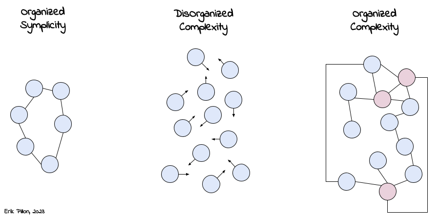

# Science and Complexity
### Author: Warren Weaver

I stumbled upon this article while reading the amazing book of Kate Raworth "[Doughnut Economics](https://www.amazon.com/Doughnut-Economics-Seven-21st-Century-Economist/dp/1603587969?crid=2934OKO7ZWZ0Q&keywords=doughnut+economics&qid=1681659986&sprefix=doughnut+economic%2Caps%2C406&sr=8-1&returnFromLogin=1&linkCode=ll1&tag=the52ndbook-20&linkId=de8898214f6653904c2edf217c1f88b3&language=en_US&ref_=as_li_ss_tl)"(that btw I'm recommending to everyone) and was quoting extremely interesting paragraph and reproposing visionaries theories. I founded a free version of [the article](https://fernandonogueiracosta.files.wordpress.com/2015/08/warren-weaver-science-and-complexity-1948.pdf) and here's what I learnt. 

## Background

* While in the paper is never mentioned, the XXI century reader will recognize easily the connections between what Weaver call _complexity_ and what we know call "**chaos theory**". As the concept of chaos theory had not yet been developed at the time of his writing, the idea of "chaotic" behaviours in complex systems, where the modification of one parameters generates unpredictable outcomes in the bigger system, is already laid off. Overall, Weaver's perspective suggests that there is a close *relationship between complexity and unpredictability*, which could be considered similar to chaos in modern terms.
* This paper is almost contemporary to the first article about **information theory** (of which Weaver is one of the authors, together with Shannon). It is incredible to notice how many of the ideas that will be presented in that paper are already rudimentary present here; He notes that the concept of entropy, which is a measure of the amount of disorder or randomness in a system, is closely related to the concept of information. Weaver proposes that information theory can be used to deal with the limitations of traditional scientific methods in dealing with complex systems. He suggests that new methods and approaches (coming for example from statistical mechanics, mathematical models or computer simulations) can help to deal with the increasing complexity of systems. Overall, Weaver's perspective suggests that there is a close relationship between complexity and information theory and suggests that information theory will help in overcoming that shortfall of traditional methods.

## Synopsys

"Science and Complexity" is an influential paper written by Warren Weaver in 1948 (i.e., more than 70 years ago, that gives quite an idea about how visionary this article was), which explores the concept of complexity and its implications for scientific research.

In the paper, Weaver attempts to give a definition of "complexity": for the author complexity is a measure of the number of variables involved (e.g., number of particles and their spacetime coordinates) in a system, as well as the interactions between those variables. It is shown that while traditional methods have been extremely effective and useful for "few variables systems", the same methods can't be employed anymore while dealing with modern problems, like the studies of gas (hence molecular problems), meteorology, macro economical problems, sociological problems, etc. As the famous saying goes, "modern problems requires modern solutions"!

Weaver suggests that new methods and approaches are needed to deal with complex systems, including the use of mathematical models, computer simulations (what he still calls "electronic calculators"), and interdisciplinary collaboration between experts from different fields. [^1]

[^1]: it is indeed in this period that the field of applied mathematics was born. After realizing the importance of a multidisciplinary approach to complex problems (i.e., the Enigma machine during WWII), scientists started realizing how mixing people with different backgrounds created a synergetic loop where ideas can reproduce easily generating new original tools and approaches.

* In the first section, Weaver defines complexity as a measure of the number of variables involved in a system and the interactions between those variables. He suggests that complexity is a fundamental property of the world we live in and that many of the most important problems facing humanity are complex in nature. Weaver also notes that the traditional scientific method, which involves breaking down complex systems into simpler parts and studying them in isolation, is not always effective in dealing with complex systems (a criticism of reductionism). A classification that separates simple, few-variable problems from the “disorganized complexity” of numerous-variable problems suitable for probability analysis. The problems in the middle are “organized complexity” with a moderate number of variables and interrelationships that cannot be fully captured in probability statistics.
* In the second section, Weaver discusses the limitations of traditional scientific methods in dealing with complex systems. He argues that as the complexity of a system increases, it becomes increasingly difficult to understand and predict the behavior of the system.

To overcome these limitations, Weaver proposes new approaches to studying complex phenomena. He suggests that new methods and approaches are needed to deal with complex systems, including the use of mathematical models, computer simulations, and interdisciplinary collaboration between experts from different fields. He also emphasizes the importance of recognizing the limitations of scientific knowledge in the face of complexity, and the need for scientists to remain humble and open to new ideas.

Overall, "Science and Complexity" is a thought-provoking paper that challenged the traditional view of science and had a significant impact on the development of complex systems theory and interdisciplinary research. It emphasizes the need for new approaches to studying complex phenomena and the importance of recognizing the limitations of scientific knowledge in the face of complexity.

## Summary

1. Complexity is a fundamental property of the world we live in.
2. Traditional scientific methods are not always effective in dealing with complex systems. The limitations of traditional scientific methods in dealing with complex systems include:
   - Limitations of measurement and observation
   - Limitations of mathematical analysis
   - Limitations of reductionism
   
   New approaches are needed to study complex systems, including:
   - Mathematical models
   - Computer simulations
   - Interdisciplinary collaboration between experts from different fields.

4. Recognizing the limitations of scientific knowledge in the face of complexity is important.
5. Scientists should remain humble and open to new ideas in the study of complex phenomena.

## Further Bibliography and additional resources:

- [Science and Complexity](https://fernandonogueiracosta.files.wordpress.com/2015/08/warren-weaver-science-and-complexity-1948.pdf): the original article by Weaver published in 1948

- [Thinking in systems](https://www.amazon.com/Thinking-Systems-Donella-H-Meadows/dp/1603580557?crid=36LM7R2E5AEVX&keywords=thinking+in+systems&qid=1681660859&sprefix=thinking+in+syste%2Caps%2C280&sr=8-1&linkCode=ll1&tag=the52ndbook-20&linkId=a545a5adf70cd292b1a6b13420020cf9&language=en_US&ref_=as_li_ss_tl) by Donella Meadow: A comprehensive introduction to systems thinking, a way of understanding and analyzing complex systems.

- [Doughnut Economics](https://www.amazon.com/Doughnut-Economics-Seven-21st-Century-Economist/dp/1603587969?crid=2934OKO7ZWZ0Q&keywords=doughnut+economics&qid=1681659986&sprefix=doughnut+economic%2Caps%2C406&sr=8-1&returnFromLogin=1&linkCode=ll1&tag=the52ndbook-20&linkId=de8898214f6653904c2edf217c1f88b3&language=en_US&ref_=as_li_ss_tl): In this book is presented a new economical model based on the fact that we need to understand the economy as a complex system that is embedded within society and the environment.

